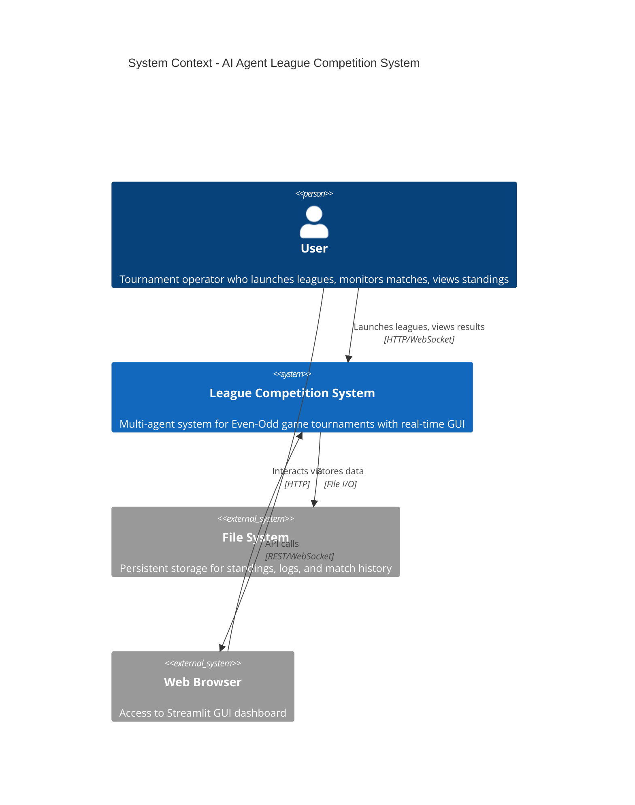
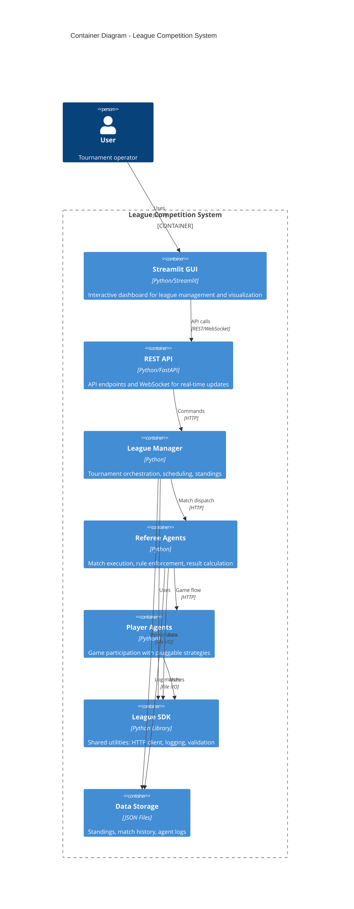
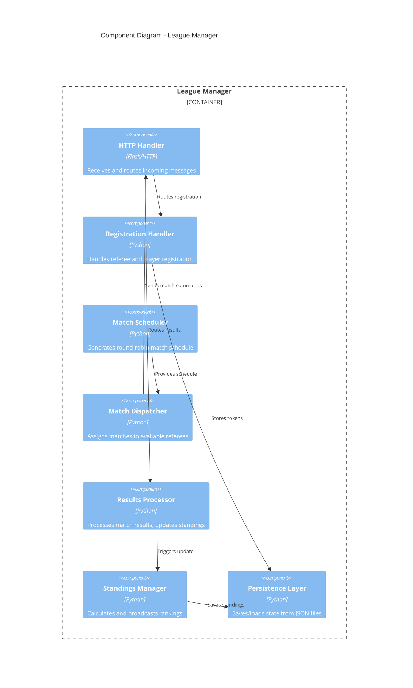
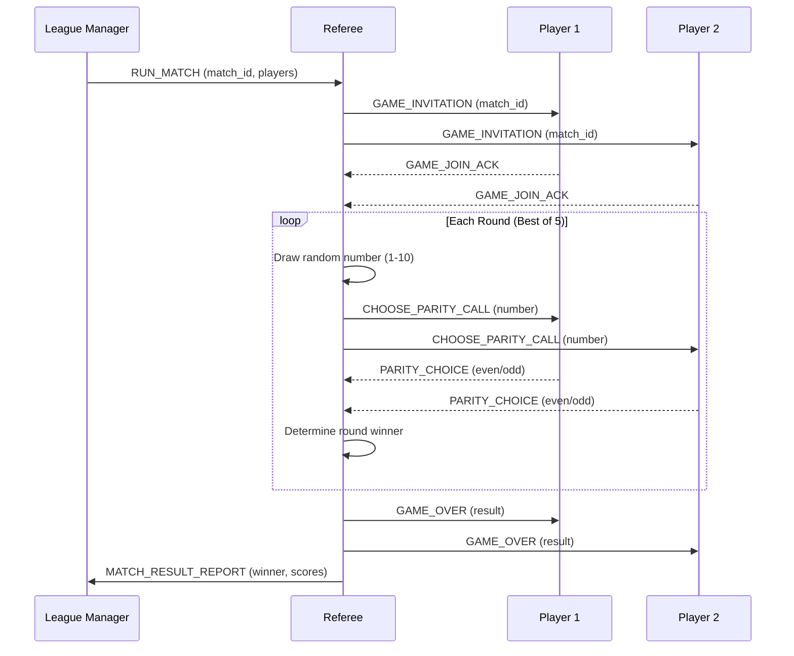
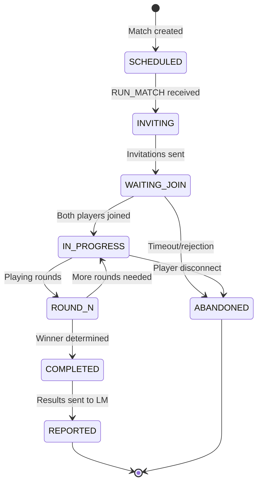
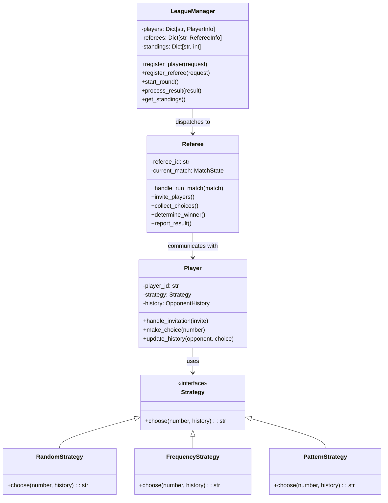

# System Architecture

**Document Version**: 1.0  
**Last Updated**: 2025-12-20

---

## Overview

The AI Agent League Competition System implements a multi-agent architecture for running Even-Odd game tournaments. The system uses a three-layer design with clear separation of concerns.

---

## Architecture Diagram

```
                    ┌─────────────────────────────────────────┐
                    │           ORCHESTRATION LAYER           │
                    │  ┌─────────────────────────────────┐    │
                    │  │      League Manager (LM01)      │    │
                    │  │          Port: 8000             │    │
                    │  │  - Tournament orchestration     │    │
                    │  │  - Standings management         │    │
                    │  │  - Round scheduling             │    │
                    │  └─────────────────────────────────┘    │
                    └───────────────┬─────────────────────────┘
                                    │
                    ┌───────────────┴─────────────────────────┐
                    │           EXECUTION LAYER               │
                    │                                         │
                    │  ┌──────────────┐  ┌──────────────┐     │
                    │  │  Referee 01  │  │  Referee 02  │     │
                    │  │  Port: 8001  │  │  Port: 8002  │     │
                    │  │  - Game flow │  │  - Game flow │     │
                    │  │  - Rule      │  │  - Rule      │     │
                    │  │    enforce   │  │    enforce   │     │
                    │  └──────┬───────┘  └──────┬───────┘     │
                    └─────────┼─────────────────┼─────────────┘
                              │                 │
                    ┌─────────┴─────────────────┴─────────────┐
                    │           PARTICIPANT LAYER             │
                    │                                         │
                    │  ┌────────┐ ┌────────┐ ┌────────┐ ┌───┐ │
                    │  │ P01    │ │ P02    │ │ P03    │ │P04│ │
                    │  │ 8101   │ │ 8102   │ │ 8103   │ │8104│
                    │  │Random  │ │Freq    │ │Pattern │ │Rnd│ │
                    │  └────────┘ └────────┘ └────────┘ └───┘ │
                    └─────────────────────────────────────────┘
```

---

## Three-Layer Design

### Layer 1: Orchestration (League Manager)
- **Role**: Central coordinator for tournament management
- **Responsibilities**:
  - Accept referee and player registrations
  - Generate round-robin match schedules
  - Dispatch match assignments to referees
  - Collect and process match results
  - Maintain and broadcast standings
  - Signal round/league completion

### Layer 2: Execution (Referees)
- **Role**: Match execution and rule enforcement
- **Responsibilities**:
  - Invite players to matches
  - Draw random numbers (1-10)
  - Collect parity choices from players
  - Determine match winners
  - Report results to League Manager

### Layer 3: Participation (Players)
- **Role**: Game participation with strategy
- **Responsibilities**:
  - Register with League Manager
  - Respond to game invitations
  - Submit parity choices (even/odd)
  - Track opponent history for strategy

---

## Port Allocation

| Agent | Port | Endpoint | Description |
|-------|------|----------|-------------|
| League Manager | 8000 | /mcp | Central orchestrator |
| Referee 01 | 8001 | /mcp | Match referee |
| Referee 02 | 8002 | /mcp | Match referee |
| Player 01 | 8101 | /mcp | RandomStrategy |
| Player 02 | 8102 | /mcp | FrequencyStrategy |
| Player 03 | 8103 | /mcp | PatternStrategy |
| Player 04 | 8104 | /mcp | RandomStrategy |

---

## Communication Protocol

All agents communicate via HTTP POST requests to `/mcp` endpoints using JSON messages with these required fields:

```json
{
  "protocol": "league.v2",
  "message_type": "<MESSAGE_TYPE>",
  "timestamp": "2025-12-20T12:00:00.000Z",
  "conversation_id": "<UUID>",
  "sender": "<AGENT_ID>",
  "league_id": "<LEAGUE_ID>",
  "round_id": <ROUND_NUMBER>,
  "match_id": "<MATCH_ID>"
}
```

---

## Data Flow

### Registration Phase
1. Referees send `REFEREE_REGISTER_REQUEST` → LM responds with token
2. Players send `LEAGUE_REGISTER_REQUEST` → LM responds with token

### Match Execution Phase
1. LM sends `RUN_MATCH` → Referee
2. Referee sends `GAME_INVITATION` → Both Players
3. Players respond `GAME_JOIN_ACK` → Referee
4. Referee sends `CHOOSE_PARITY_CALL` → Both Players
5. Players respond `PARITY_CHOICE` → Referee
6. Referee sends `GAME_OVER` → Both Players
7. Referee sends `MATCH_RESULT_REPORT` → LM

### Round Completion Phase
1. LM broadcasts `ROUND_COMPLETED` to all
2. LM broadcasts `LEAGUE_STANDINGS_UPDATE` to all

---

## Key Design Decisions

1. **Stateless HTTP**: Each request is independent; state persisted in files
2. **Round-Robin Scheduling**: All players play each other exactly once
3. **Parallel Matches**: Multiple referees enable concurrent match execution
4. **Strategy Abstraction**: Players use pluggable strategy classes
5. **File-Based Persistence**: JSON files for standings and match history
---

## 🏛️ C4 Model Architecture

### C4 Level 1: System Context

**Purpose**: Shows how the League Competition System fits into the broader ecosystem.



### C4 Level 2: Container Diagram

**Purpose**: Shows the high-level containers that make up the system.



### C4 Level 3: Component Diagram (League Manager)

**Purpose**: Internal components of the League Manager container.



---

## 📊 UML Diagrams

### Sequence Diagram: Match Execution



### State Diagram: Match Lifecycle



### Class Diagram: Core Components



---

## 🔄 Deployment Architecture

### Local Development

```
┌─────────────────────────────────────────────────────────────┐
│                    Development Machine                       │
│                                                             │
│  ┌─────────────┐  ┌─────────────┐  ┌─────────────────────┐ │
│  │ Streamlit   │  │ FastAPI     │  │ Agent Processes     │ │
│  │ GUI         │  │ Server      │  │ ┌─────┐ ┌─────────┐ │ │
│  │ :8501       │  │ :8080       │  │ │ LM  │ │ REF 1-2 │ │ │
│  └─────────────┘  └─────────────┘  │ │:8000│ │:8001-02 │ │ │
│                                     │ └─────┘ └─────────┘ │ │
│                                     │ ┌─────────────────┐ │ │
│                                     │ │ Players 1-4     │ │ │
│                                     │ │ :8101-8104      │ │ │
│                                     │ └─────────────────┘ │ │
│                                     └─────────────────────┘ │
│                                                             │
│  ┌─────────────────────────────────────────────────────┐   │
│  │               Shared File System                     │   │
│  │  SHARED/data/   SHARED/logs/   SHARED/config/       │   │
│  └─────────────────────────────────────────────────────┘   │
└─────────────────────────────────────────────────────────────┘
```

### Production (Future)

```
┌─────────────────────────────────────────────────────────────┐
│                     Kubernetes Cluster                       │
│                                                             │
│  ┌─────────────────────────────────────────────────────┐   │
│  │                   Ingress Controller                 │   │
│  └─────────────────────┬───────────────────────────────┘   │
│                        │                                    │
│  ┌────────────────┬────┴────────────┬────────────────┐    │
│  │                │                  │                │    │
│  │  ┌──────────┐  │  ┌──────────┐   │  ┌──────────┐  │    │
│  │  │ GUI Pod  │  │  │ API Pod  │   │  │ LM Pod   │  │    │
│  │  │ (x2)     │  │  │ (x2)     │   │  │ (x1)     │  │    │
│  │  └──────────┘  │  └──────────┘   │  └──────────┘  │    │
│  │                │                  │                │    │
│  │  ┌──────────┐  │  ┌──────────┐   │  ┌──────────┐  │    │
│  │  │ Referee  │  │  │ Player   │   │  │ Redis    │  │    │
│  │  │ Pods(x4) │  │  │ Pods(x8) │   │  │ Cluster  │  │    │
│  │  └──────────┘  │  └──────────┘   │  └──────────┘  │    │
│  └────────────────┴─────────────────┴────────────────┘    │
│                                                             │
│  ┌─────────────────────────────────────────────────────┐   │
│  │           Persistent Volume Claims (PVC)             │   │
│  │     standings/   logs/   config/   match-history/   │   │
│  └─────────────────────────────────────────────────────┘   │
└─────────────────────────────────────────────────────────────┘
```

---

## 📚 Related Documents

- [DESIGN_DOCUMENT.md](DESIGN_DOCUMENT.md) - Detailed design decisions
- [protocol_spec.md](protocol_spec.md) - Protocol specification
- [ADRs/](ADRs/) - Architectural Decision Records
- [BUILDING_BLOCKS.md](BUILDING_BLOCKS.md) - Component documentation