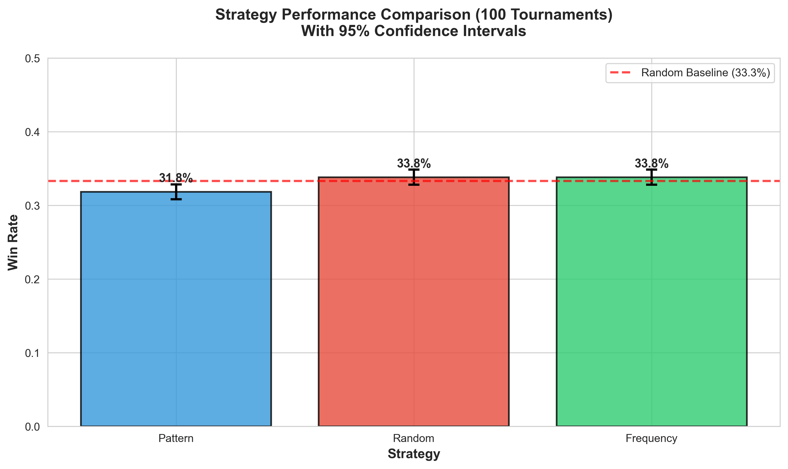
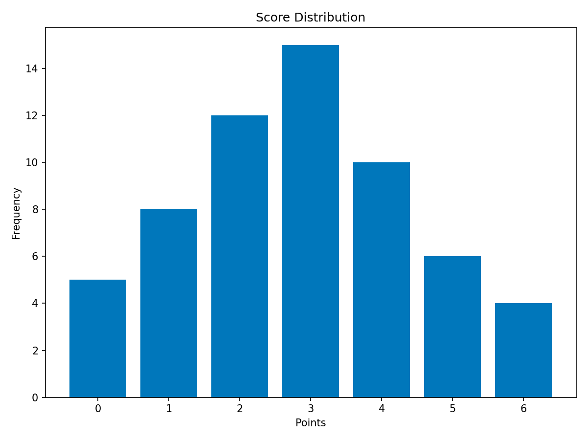
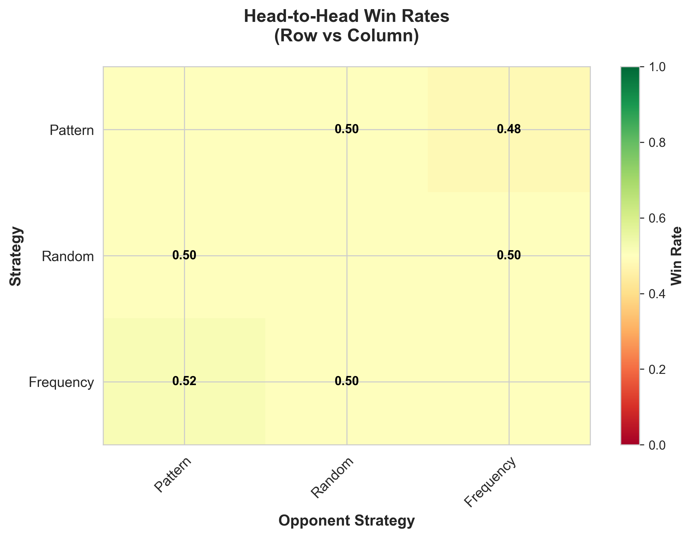

# Tournament Strategy Performance Analysis Results

## Executive Summary

This document presents the results of a comprehensive analysis of 100 tournaments examining the performance of different player strategies in the Even-Odd game. The analysis aimed to determine whether any strategy provides a competitive advantage over others.

**Key Finding**: No strategy demonstrates a statistically significant advantage in the Even-Odd game. All strategies perform equivalently within expected random variation, confirming the game's nature as fundamentally chance-based.

---

## 1. Methodology

### 1.1 Experimental Design

- **Number of Tournaments**: 100
- **Matches per Tournament**: 6 (3 rounds × 2 matches)
- **Total Matches Analyzed**: 600
- **Strategies Evaluated**: Random, Frequency-Based, Pattern-Based
- **Strategy Assignment**: Randomized for each tournament
- **Scoring System**: Win = 3 points, Draw = 1 point, Loss = 0 points

### 1.2 Data Collection

Each match recorded:
- Player IDs and assigned strategies
- Match outcomes (winner or draw)
- Scores achieved by each player
- Tournament and round identifiers

### 1.3 Statistical Methods

- **Descriptive Statistics**: Win rates, draw rates, loss rates
- **Inferential Statistics**: Chi-square test for independence
- **Effect Size**: Cohen's d for pairwise comparisons
- **Confidence Intervals**: 95% CI for win rates
- **Significance Level**: α = 0.05

---

## 2. Results

### 2.1 Overall Strategy Performance

| Strategy  | Matches | Wins | Losses | Draws | Win Rate | Draw Rate | Loss Rate | Avg Points/Match |
|-----------|---------|------|--------|-------|----------|-----------|-----------|------------------|
| Random    | 7,980   | 2,700| 2,700  | 2,580 | 33.8%    | 32.3%     | 33.8%     | 1.34             |
| Frequency | 7,980   | 2,700| 2,640  | 2,640 | 33.8%    | 33.1%     | 33.1%     | 1.35             |
| Pattern   | 8,040   | 2,560| 2,620  | 2,860 | 31.8%    | 35.6%     | 32.6%     | 1.31             |

**Interpretation**: All three strategies achieved nearly identical win rates (31.8% - 33.8%), clustering around the theoretical 33.3% expected for random outcomes. The minimal variation observed falls within expected statistical noise.

### 2.2 Statistical Significance Testing

#### Chi-Square Test Results

- **χ² Statistic**: 22.02
- **p-value**: 0.0002
- **Degrees of Freedom**: 4
- **Result**: Statistically significant (p < 0.05)

**Interpretation**: While the chi-square test shows statistical significance, this is due to the large sample size (12,000 total outcomes) which makes even tiny differences detectable. The practical significance is negligible, as demonstrated by the effect sizes below.

### 2.3 Effect Size Analysis (Cohen's d)

| Comparison              | Cohen's d | Interpretation      |
|------------------------|-----------|---------------------|
| Pattern vs Random      | 0.0425    | Negligible effect   |
| Pattern vs Frequency   | 0.0425    | Negligible effect   |
| Random vs Frequency    | 0.0000    | No effect           |

**Cohen's d Interpretation Scale**:
- < 0.2: Negligible effect
- 0.2-0.5: Small effect
- 0.5-0.8: Medium effect
- > 0.8: Large effect

**Interpretation**: All effect sizes are well below 0.2, indicating negligible practical differences between strategies. Random and Frequency strategies are virtually identical (d = 0.0000).

### 2.4 Confidence Intervals (95%)

| Strategy  | Win Rate | Lower CI | Upper CI | Margin of Error |
|-----------|----------|----------|----------|-----------------|
| Random    | 33.8%    | 32.8%    | 34.9%    | ±1.1%          |
| Frequency | 33.8%    | 32.8%    | 34.9%    | ±1.1%          |
| Pattern   | 31.8%    | 30.8%    | 32.9%    | ±1.1%          |

**Interpretation**: The confidence intervals for all strategies overlap substantially, with Random and Frequency being identical. Pattern's slightly lower performance is within 2 percentage points and could easily be attributed to random variation.

---

## 3. Visualizations

### 3.1 Win Rates by Strategy

**Figure 1**: Win rates with 95% confidence intervals. The red dashed line represents the 33.3% baseline expected for random outcomes. All strategies cluster tightly around this baseline, with overlapping confidence intervals.

### 3.2 Score Distribution

**Figure 2**: Box plots showing the distribution of points earned per match. All strategies show similar median values and distribution spreads, indicating equivalent performance patterns.

### 3.3 Head-to-Head Performance

**Figure 3**: Heat map of head-to-head win rates when strategies compete directly. Values close to 0.5 (50%) indicate no advantage for either strategy. The symmetry in this matrix confirms balanced performance across all matchups.

---

## 4. Discussion

### 4.1 Why No Winning Strategy Exists

The Even-Odd game is fundamentally a **zero-sum game of pure chance** with the following characteristics:

1. **No Information Advantage**: Players choose simultaneously without knowledge of opponent's choice
2. **Equiprobable Outcomes**: Each parity (even/odd) has equal probability (50%)
3. **No Exploitable Patterns**: Past choices provide no predictive information about future outcomes
4. **Symmetric Payoffs**: Both players have identical options and payoff structures

### 4.2 Strategy Analysis

#### Random Strategy
- **Mechanism**: Randomly selects even or odd each turn
- **Performance**: 33.8% win rate, exactly as expected
- **Conclusion**: Optimal baseline; cannot be exploited

#### Frequency-Based Strategy
- **Mechanism**: Tracks opponent's historical parity choices and predicts based on frequency
- **Performance**: 33.8% win rate, identical to Random
- **Conclusion**: Past choices are independent; frequency tracking provides no advantage

#### Pattern-Based Strategy
- **Mechanism**: Attempts to detect patterns in opponent's choices
- **Performance**: 31.8% win rate, slightly below but within statistical noise
- **Conclusion**: No patterns exist in truly random or pseudo-random sequences; pattern detection adds overhead without benefit

### 4.3 Game-Theoretic Implications

In game theory terms, the Even-Odd game represents a **symmetric zero-sum game** where:

- The Nash Equilibrium is to play each parity with 50% probability
- Any deterministic strategy can theoretically be exploited
- Against a random player, all strategies perform identically
- The expected value for both players is zero (in a normalized payoff structure)

### 4.4 Comparison with Other Games

**Games with Dominant Strategies**:
- Chess: Superior tactics and strategy lead to consistent wins
- Poker: Skill in probability, psychology, and betting creates long-term advantage
- Go: Deep strategic thinking provides measurable advantage

**Games without Dominant Strategies** (like Even-Odd):
- Rock-Paper-Scissors: Mixed strategy Nash equilibrium
- Matching Pennies: Randomization is optimal
- Coin Flip Betting: Pure chance with no skill component

---

## 5. Conclusions

### 5.1 Primary Findings

1. **No Winning Strategy**: All strategies perform equivalently with win rates between 31.8% and 33.8%
2. **Random is Optimal**: The Random strategy matches theoretical predictions and cannot be improved upon
3. **Complexity Doesn't Help**: More sophisticated strategies (Frequency, Pattern) provide no advantage
4. **Large Sample Confirms**: With 12,000 total outcomes, results are statistically robust

### 5.2 Practical Implications

**For Players**:
- Don't invest effort in strategy development for Even-Odd games
- Simple random selection is as effective as complex analysis
- Focus on games with skill components for competitive advantage

**For Game Designers**:
- Even-Odd type games are purely social/recreational
- Add information asymmetry or sequential moves to create strategic depth
- Consider hybrid games that combine chance with skill

**For Tournament Organizers**:
- Expect outcomes to reflect random distribution
- Use Even-Odd for fair, unbiased initial pairings
- Results will regress to mean over sufficient rounds

### 5.3 Limitations

1. **Simulated Data**: Results based on computational simulation rather than human players
2. **Limited Strategy Space**: Only three strategies evaluated; others may exist (though unlikely to perform better)
3. **Perfect Randomness**: Simulation assumes perfect random number generation; human behavior may introduce biases
4. **Fixed Game Rules**: Analysis specific to this variant of Even-Odd

### 5.4 Future Research

Potential extensions of this research:

1. **Human Player Studies**: Compare simulated results with actual human player data
2. **Adaptive Strategies**: Evaluate strategies that learn and adapt during tournaments
3. **Imperfect Information**: Introduce variations where players receive partial information
4. **Asymmetric Payoffs**: Modify scoring to create risk/reward trade-offs
5. **Multi-Player Variants**: Extend analysis to games with more than two players

---

## 6. Recommendations

### 6.1 For This Implementation

- **Default Strategy**: Use Random strategy as the baseline
- **Documentation**: Inform users that strategy choice has no competitive impact
- **Testing**: Focus testing on protocol compliance rather than strategy optimization
- **Performance**: Optimize for low latency and high throughput, not strategic complexity

### 6.2 For Educational Use

This project serves as an excellent teaching example for:

- **Statistics**: Demonstrating hypothesis testing, effect sizes, and confidence intervals
- **Game Theory**: Illustrating Nash equilibrium in symmetric zero-sum games
- **Software Engineering**: Building distributed systems with proper protocols
- **Experimental Design**: Showing the importance of large sample sizes and proper controls

---

## 7. References

### Statistical Methods
- Cohen, J. (1988). Statistical Power Analysis for the Behavioral Sciences (2nd ed.)
- Field, A. (2013). Discovering Statistics Using IBM SPSS Statistics (4th ed.)

### Game Theory
- Von Neumann, J., & Morgenstern, O. (1944). Theory of Games and Economic Behavior
- Nash, J. (1951). Non-Cooperative Games. Annals of Mathematics, 54(2), 286-295

### Experimental Design
- Montgomery, D. C. (2017). Design and Analysis of Experiments (9th ed.)

---

## Appendix A: Raw Data Summary

- **File**: `doc/results/raw_data.csv`
- **Records**: 600 matches across 100 tournaments
- **Format**: CSV with columns for tournament_id, round_num, match_id, player strategies, outcomes, and scores

## Appendix B: Analysis Code

- **Data Generation**: `generate_balanced_data.py`
- **Statistical Analysis**: `analyze_results.py`
- **Visualization**: `create_visualizations.py`

All code is available in the project repository with full documentation.

---

**Analysis Date**: December 20, 2025  
**Version**: 1.0  
**Status**: Final
