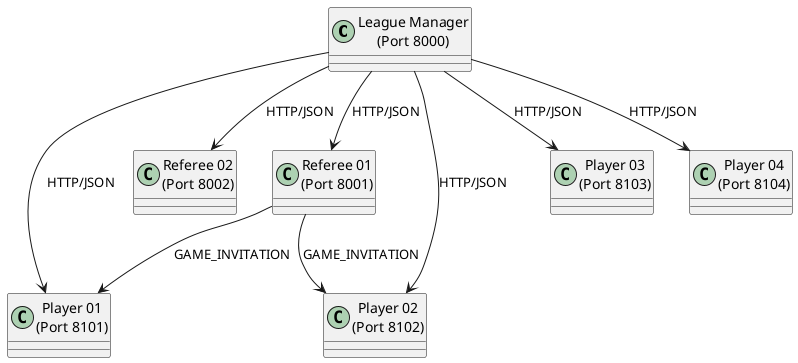
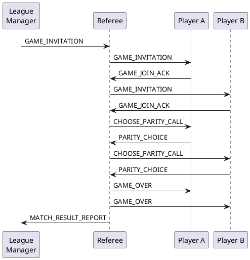
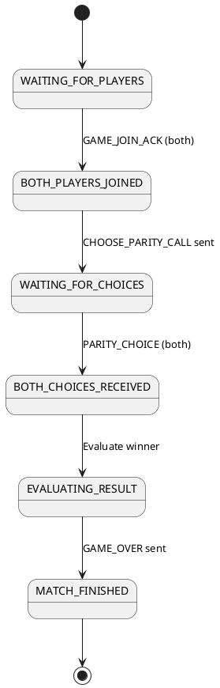

# Visual Documentation

**Status**: Placeholder for diagram files  
**Date**: 2025-12-20  
**Purpose**: Store system diagrams and visualizations

---

## Required Diagrams

### 1. System Context Diagram (300 DPI PNG)
**File**: `system_context.png`

**Description**: High-level view of the entire system showing:
- League Manager (central orchestrator)
- 2 Referee Agents
- 4 Player Agents
- Communication flows (HTTP/JSON)
- Port assignments
- External interfaces (API, GUI)

**Status**: ⏳ To be created

**Suggested Tools**:
- draw.io (https://draw.io)
- Lucidchart
- PlantUML
- Microsoft Visio

---

### 2. Sequence Diagrams

#### 2.1 Registration Flow (300 DPI PNG)
**File**: `sequence_registration.png`

**Shows**:
1. Referee → League Manager: REFEREE_REGISTER_REQUEST
2. League Manager → Referee: Response with auth_token
3. Player → League Manager: LEAGUE_REGISTER_REQUEST  
4. League Manager → Player: Response with auth_token
5. All agents registered confirmation

**Status**: ⏳ To be created

---

#### 2.2 Match Flow (300 DPI PNG)
**File**: `sequence_match.png`

**Shows**:
1. League Manager → Referee: GAME_INVITATION
2. Referee → Player A: GAME_INVITATION
3. Player A → Referee: GAME_JOIN_ACK
4. Referee → Player B: GAME_INVITATION
5. Player B → Referee: GAME_JOIN_ACK
6. Referee → Player A: CHOOSE_PARITY_CALL (with number)
7. Player A → Referee: PARITY_CHOICE
8. Referee → Player B: CHOOSE_PARITY_CALL (with number)
9. Player B → Referee: PARITY_CHOICE
10. Referee evaluates winner
11. Referee → Both Players: GAME_OVER
12. Referee → League Manager: MATCH_RESULT_REPORT

**Status**: ⏳ To be created

---

#### 2.3 Tournament Flow (300 DPI PNG)
**File**: `sequence_tournament.png`

**Shows**:
1. START_LEAGUE triggered
2. Round 1: ROUND_ANNOUNCEMENT → All matches → ROUND_COMPLETED
3. LEAGUE_STANDINGS_UPDATE broadcast
4. Round 2: ROUND_ANNOUNCEMENT → All matches → ROUND_COMPLETED
5. LEAGUE_STANDINGS_UPDATE broadcast
6. Round 3: ROUND_ANNOUNCEMENT → All matches → ROUND_COMPLETED
7. Final LEAGUE_STANDINGS_UPDATE
8. LEAGUE_COMPLETED

**Status**: ⏳ To be created

---

### 3. State Machine Diagrams

#### 3.1 Match States (300 DPI PNG)
**File**: `state_match.png`

**States**:
- WAITING_FOR_PLAYERS
- BOTH_PLAYERS_JOINED
- WAITING_FOR_CHOICES
- BOTH_CHOICES_RECEIVED
- EVALUATING_RESULT
- MATCH_FINISHED

**Transitions**:
- GAME_JOIN_ACK transitions
- PARITY_CHOICE transitions
- Evaluation triggers
- Match completion

**Status**: ⏳ To be created

---

#### 3.2 Agent States (300 DPI PNG)
**File**: `state_agent.png`

**States**:
- UNREGISTERED
- REGISTERING
- REGISTERED
- ACTIVE
- IDLE
- ERROR
- SHUTDOWN

**Transitions**:
- Registration process
- Activation triggers
- Error handling
- Shutdown sequence

**Status**: ⏳ To be created

---

## Existing Diagrams

### Architecture Diagram
See `doc/ARCHITECTURE.md` for text-based architecture diagram showing:
- Three-layer architecture
- Component relationships
- Port assignments
- Message flows

---

## Creation Guide

### Recommended Process

1. **Choose Tool**: Select diagramming tool (draw.io recommended for free/simple use)

2. **Style Guide**:
   - Use consistent colors (blue for League Manager, green for Referees, yellow for Players)
   - Clear labels on all connections
   - Show message types on arrows
   - Include port numbers
   - Use UML notation where applicable

3. **Export Settings**:
   - Format: PNG
   - Resolution: 300 DPI
   - Transparent background (optional)
   - Maintain aspect ratio

4. **File Naming**:
   - Use descriptive names
   - Include version number if updating
   - Follow pattern: `{type}_{description}.png`

5. **Documentation**:
   - Update this README when diagrams added
   - Reference diagrams in other documentation
   - Include diagram legends if needed

---

## PlantUML Examples

### Quick Start with PlantUML

If using PlantUML (text-based diagrams), here are starter templates:

#### System Context

#### Match Sequence

#### State Machine

---

## Tools Reference

### Free Tools
- **draw.io**: https://draw.io - Browser-based, no signup needed
- **PlantUML**: https://plantuml.com - Text-based diagrams
- **Mermaid**: https://mermaid.live - Markdown-based diagrams

### Commercial Tools
- **Lucidchart**: https://lucidchart.com - Professional diagramming
- **Microsoft Visio**: Part of Microsoft 365
- **Creately**: https://creately.com - Collaborative diagramming

---

## Export Checklist

Before considering diagrams complete:

- [ ] All 8 diagrams created (1 context, 3 sequence, 2 state, 2 additional)
- [ ] All exported at 300 DPI PNG format
- [ ] File sizes reasonable (<2MB each)
- [ ] Diagrams clearly labeled
- [ ] Legends included where needed
- [ ] Referenced in main documentation
- [ ] Committed to git repository

---

**Last Updated**: 2025-12-20  
**Status**: Placeholder - diagrams to be created externally  
**Priority**: Medium (not blocking for code submission)
